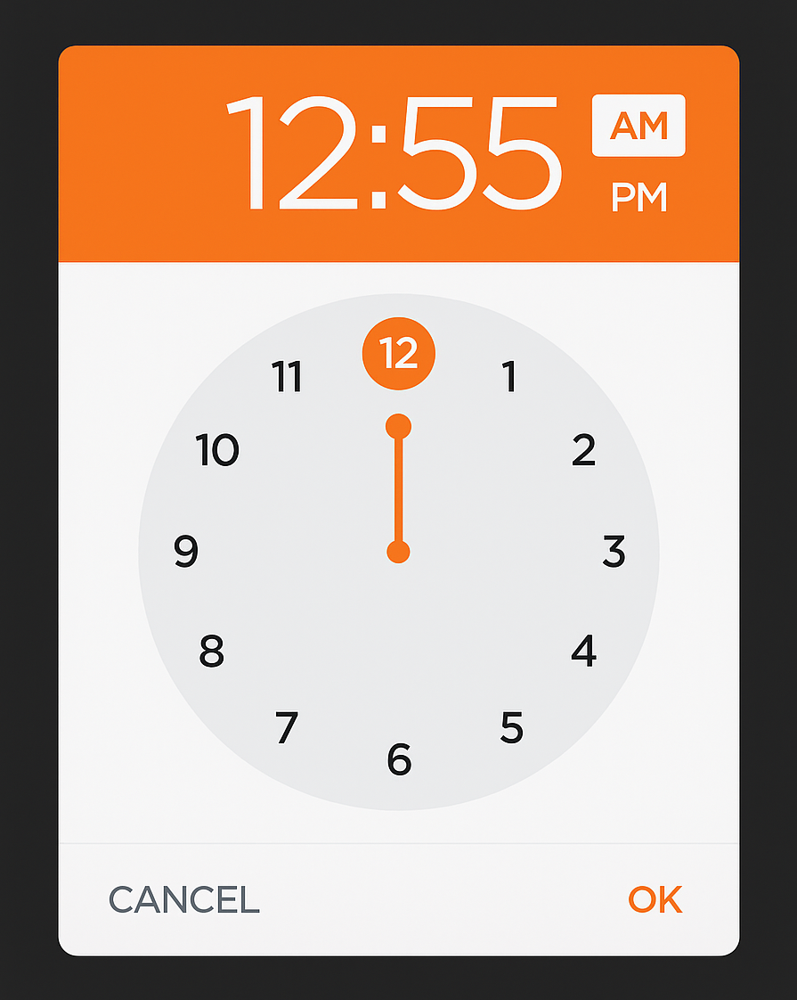

# ⏰ react-clockify



> A sleek, customizable, and mobile-friendly time picker component for React.  
Perfect for dashboards, forms, and scheduling interfaces.

## 📦 Installation

```bash
npm install react-clockify
```

or

```bash
yarn add react-clockify
```

## 🚀 Usage

```jsx
import React, { useState } from 'react';
import Clockify from 'react-clockify';

const App = () => {
  const [selectedTime, setSelectedTime] = useState('12:00');

  return (
    <div>
      <h3>Selected Time: {selectedTime}</h3>
      <Clockify 
        value={selectedTime} 
        onChange={(time) => setSelectedTime(time)} 
        format="12" // or "24"
      />
    </div>
  );
};

export default App;
```

## ⚙️ Props

| Prop        | Type     | Default | Description                                        |
|-------------|----------|---------|----------------------------------------------------|
| `value`     | `string` | `""`    | Time in "HH:mm" format                            |
| `onChange`  | `func`   |         | Callback when time is changed                     |
| `format`    | `string` | `"12"`  | Clock format: `"12"` for AM/PM or `"24"` for 24hr |

## 🎨 Features

- 🕒 Analog and digital hybrid time selection
- 📱 Responsive and mobile-friendly
- 🎯 Simple API with full control over time selection
- 🌓 AM/PM toggle or 24-hour support
- ⚛️ Lightweight and dependency-free

## 📸 Demo


## 🧪 Running Locally

```bash
git clone https://github.com/yourusername/react-clockify.git
cd react-clockify
npm install
npm run storybook
```

## 🤝 Contributing

Contributions, issues, and feature requests are welcome!  
Feel free to check [issues](https://github.com/yourusername/react-clockify/issues) or submit a PR.

## 📜 License

MIT © [Aryan Barde](https://github.com/aryanbarde80)
